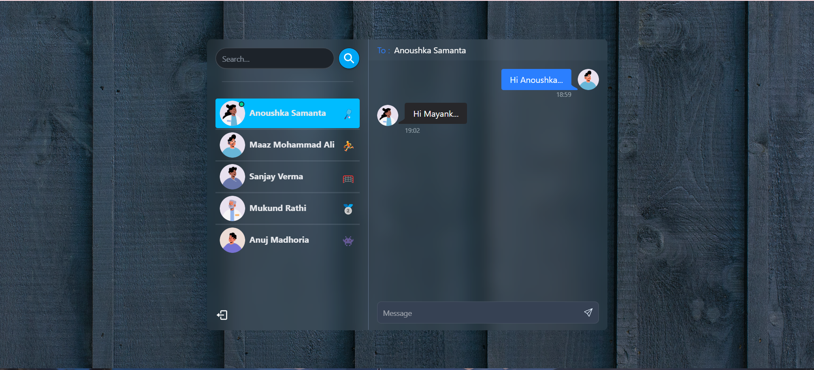

# Chat Me - Real-Time Messaging Application


## 🚀 Overview

Chat Me is a modern real-time messaging application built with React, Node.js, and Socket.IO. It provides users with a seamless communication experience through instant messaging, real-time status updates, and a responsive design.

## 👀 See Live

### Login Screen

### SignUp Screen


### Chat Interface


### Chat Demo
 


## ✨ Features

- **Real-time Messaging**: Instant message delivery using Socket.IO
- **User Authentication**: Secure JWT-based authentication
- **Responsive Design**: Works seamlessly on desktop and mobile devices
- **Online Status**: Real-time user online/offline status
- **Message History**: Persistent chat history
- **Modern UI**: Clean and intuitive interface using Tailwind CSS


## 🛠️ Tech Stack

- **Frontend**:
  - React.js
  - Tailwind CSS
  - Framer Motion
  - Socket.IO Client
  - Zustand

- **Backend**:
  - Node.js
  - Express.js
  - MongoDB
  - Socket.IO
  - JWT Authentication

## 📦 Installation

1. **Clone the repository**:
```bash
git clone https://github.com/yourusername/chat-me.git
cd chat-me
```

2. **Install dependencies**:
```bash
# Install frontend dependencies
cd frontend
npm install

# Install backend dependencies
cd ../backend
npm install
```

3. **Environment Setup**:
```bash
# In backend directory, create .env file
MONGODB_URI=your_mongodb_uri
JWT_SECRET=your_jwt_secret
PORT=5000

# In frontend directory, create .env file
VITE_SERVER_URL=http://localhost:5000
```

## 🚀 Running the Application

1. **Start the backend server(In Root directory)**:
```bash
npm run start
```

2. **Start the frontend development server**:
```bash
cd frontend
npm run dev
```

## 📱 Usage

1. Register a new account or login with existing credentials
2. Start chatting with other users in real-time
3. See who's online and their status updates
4. Enjoy instant messaging with emoji support

## 🤝 Contributing

Contributions are welcome! Please feel free to submit a Pull Request.

1. Fork the repository
2. Create your feature branch (`git checkout -b feature/AmazingFeature`)
3. Commit your changes (`git commit -m 'Add some AmazingFeature'`)
4. Push to the branch (`git push origin feature/AmazingFeature`)
5. Open a Pull Request

## 👥 Author

- [@MayankV004](https://github.com/MayankV004)

## 🙏 Acknowledgments

- Socket.IO team for the excellent real-time engine
- Tailwind CSS for the awesome styling framework
- MongoDB team for the reliable database solution

## 📞 Contact

For any queries or support, please reach out to:
- Email: mayank.msverma@gmail.com


---